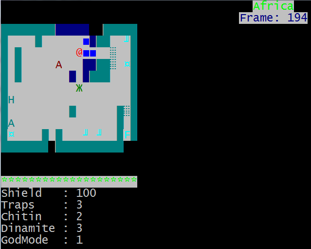

# Sentry

Sentry is rogue-like ASCII-based game.

## Build instructions
* Clone source ```git clone git@github.com:okosan/Sentry.git```
* Open Qt project file with Qt Creator (Qt 4.5 or higher is recommended)
* On Windows: ```Build->Build all``` should just work (assuming Mingw32 compiler setup).
* On Linux: before build - make sure PDCurses library is installed (edit Sentry/sentry_core/sentry_core.pro if necessary to specify full library path).

## How to start
Playing game is a good start.
```TODO: Add gameplay video link here```

* Move on a level, avoid traps and enemies, collect keys, and speed up to Finish.
* Beware bitey monsters jumping from darkness!
* Explode them or use environment against them.



* Build game or get pre-built binary somewhere (TODO: where?).
* Run game.

Controls:
Key     | Action
------- | ---------------------------------------
```←``` | move left
```→``` | move right
```↑``` | move up
```↓``` | move down
```x``` | drop Trap
```z``` | drop Key
```d``` | drop Dynamite
```e``` | explode one Dynamite on a map
```c``` | construct Dynamite from Chitin in Robik

Map legend:
Symbol | Meaning
------ | -----------------------------------
`@`    | Player character
`█`    | Strong wall
`Z`    | Destroyable wall
`░`    | Door (colour matters)
`A`    | Medkit
`H`    | Healing lake
`¤`    | Pancake
`╜`    | Key (colour matters)
`Ж`    | Beetle
`■`    | Pressing walls
`F`    | Level exit
`R`    | Robik (interactive wending machine)
`=`    | Dropped dynamite
`C`    | Carrier
`I`    | Interceptor
`8`    | Toxic cloud
`M`    | Mushroom

## Legal Stuff
Project has dependency on PDCurses library and (maybe) other libraries (see ```Sentry/thirdparty/```).
PDCurses is a public domain library, and the library included is slightly modified to simplify build process on Win32 platform. On Linux such is not necessary, because PDCurses should be available pre-build and in library search path, or the assumption is that Linux users should be able to build it from source if necessary.

The rest of the code and files (that are not under ```Sentry/thirdparty/```) is released to public domain or GPL/LGPL/MIT on your choice.

## Level editing
Levels are text files and are located in ```Sentry/levels/map_level<num>.txt```. Level numbers should go in sequential order.

## Useful links
* [original PDCurses github repository](https://github.com/wmcbrine/PDCurses/tree/master/pdcurses).


